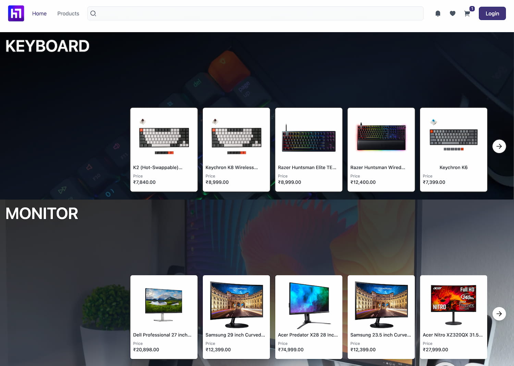

<!-- PROJECT LOGO -->
<br />
<p align="center">
  <a href="https://github.com/adi.sreyaj/compito">
    
  </a>

<h3 align="center">The WFH Store</h3>

  <p align="center">
      Ecommerce website to buy all you need to setup your home office.
      <br />
      <br />
      <a href="https://wfh-store.adi.so">View Demo</a>
      ·
      <a href="https://github.com/adisreyaj/wfh/issues">Report Bug</a>
      ·
      <a href="https://github.com/adisreyaj/wfh/issues">Request Feature</a>
  </p>

  <p align="center">
   
   
   
   
   
   
  </p>
</p>



A simple e-commerce application that is built using Angular, NestJS and MongoDB. Built as part of the MongoDB Atlas
Hackathon ([ref](https://dev.to/devteam/announcing-the-mongodb-atlas-hackathon-on-dev-4b6m)).

## Tech Stack


## Getting started

The application is a monorepo and so both the front-end and the back-end code are in the same repo.

1. Clone the repo

```shell
https://github.com/adisreyaj/wfh.git
```

2. Install dependencies

```shell
npm install
```

3. Setup the environment variables required for the API

```shell
MONGODB_URI=
AUTH0_AUDIENCE=
AUTH0_ISSUER_URL=
AUTH0_DB=

// Used for setting and internal APIs
INTERNAL_TOKEN=

```

4. Run the Front-end

```shell
npm start
```

5. Run the Back-end

```shell
npm start api
```

6. Open the URL in the browser

```shell
http://localhost:4200
```

## License

Distributed under the Apache 2.0 License. See `LICENSE` for more information.

## Show your support

Please ⭐️ this repository if this project helped you!
